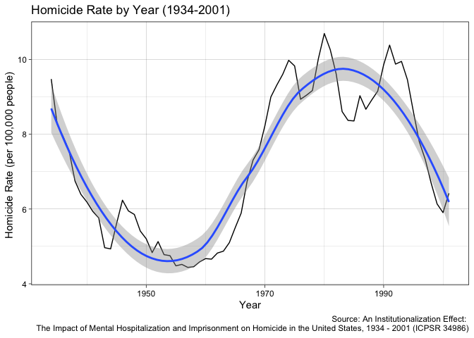
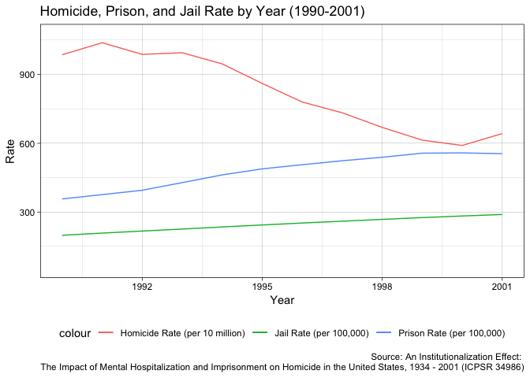
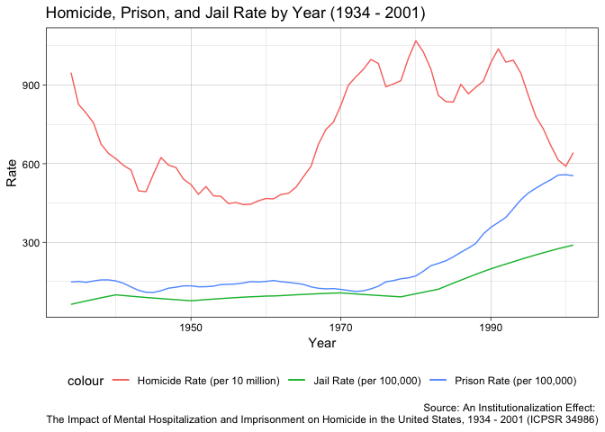
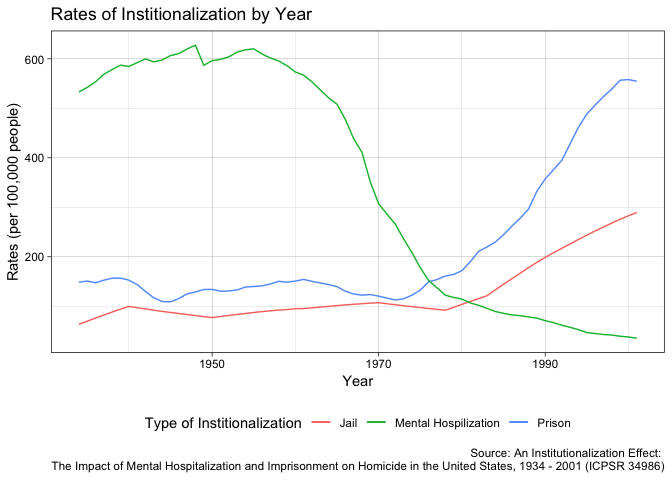
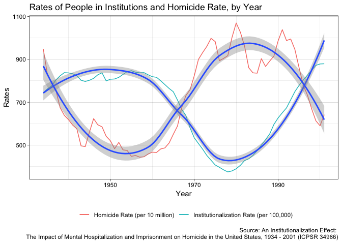
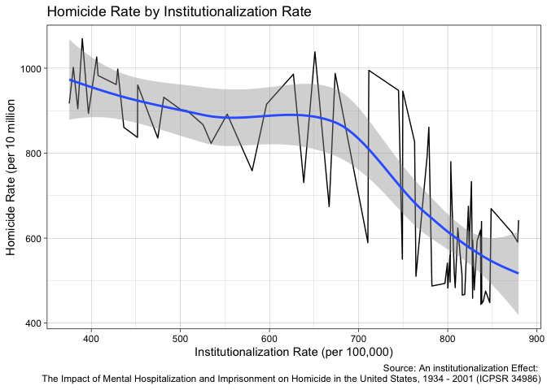

Mental Hospitalizations, Institutionalization, and Homicide Rate
================
Jess Robinson
May 6, 2019

Data Source
-----------

For this assignment, I used the data from Prof. Bernard Harcourt's research of the impact of mental hospitalization and prison's on the homicide rate. Data, and related publications based upon this data, can be found [here](https://www.icpsr.umich.edu/icpsrweb/ICPSR/studies/34986).

Homicide Trends
---------------

The chart above shows the homicide rate per 100,000 people from 1934 to 2001. As we can see, the homicide rate declines sharply from the 1930s to 1950s, then rises again from the 1960s through the 1980s, before declining once again. This investigation will consider the reasons this might be the case.

Prisons and Jails
-----------------

    ## Warning: Removed 56 rows containing missing values (geom_path).

    ## Warning: Removed 56 rows containing missing values (geom_path).

    ## Warning: Removed 56 rows containing missing values (geom_path).

It is sometimes hypothesized that a rise in the rate of penal incarceration reduces the rate of homicides. The causal mechanism behind these theories is generally that prison and jail deter or incapacite the people who would otherwise commit homicides.

This is especially the case in theories that explain the 1990s drop in crime. Looking at the first chart above, this explanation seems somewhat plausible.

However, looking at the second chart, we shows the general trend in homicids and incarceration since 1934, we see that a change in homicides does not correlate strongly with either the rise in prison population nor the rise in jail population over the period from 1934 until the 1990s.

| term         |    estimate|  std.error|   statistic|    p.value|
|:-------------|-----------:|----------:|-----------:|----------:|
| (Intercept)  |   5.6189250|  0.7682491|   7.3139361|  0.0000000|
| prison\_rate |  -0.0077233|  0.0093400|  -0.8268986|  0.4113199|
| jail\_rate   |   0.0256812|  0.0204663|   1.2548006|  0.2140442|

|       |  r.squared|  adj.r.squared|     sigma|  statistic|    p.value|   df|     logLik|       AIC|       BIC|  deviance|  df.residual|
|-------|----------:|--------------:|---------:|----------:|----------:|----:|----------:|---------:|---------:|---------:|------------:|
| value |  0.0883882|      0.0603386|  1.921308|   3.151141|  0.0494109|    3|  -139.3582|  286.7163|  295.5944|  239.9427|           65|

Likewise, after running a regression, we see that the relationship between homicide rates and prison and jail rates is not statistically significant, with high p-values of 0.411 and 0.214 for prison rates and jail rates respectively. Moreover, these variables explain very little of the variance in homicide rate, with a model based on these values having an adjusted R-squared value of 0.06.

Mental Hospitals and Institutionalization
-----------------------------------------

However, while prison and jail rates are not strongly associated with changes in homicide rates pre-1990, other forms of institutionalization adjacent to the carceral apparatus may explain some of the variation in homicide rates.

Looking at the graph above, we see that while jail and prison rates inclined significantly since the first half of the twentieth century, mental hospitalization had long been a major form of form of institutionalization, which has since declined.

The large rate of institutionalization within mental hospitals suggests that theories of homicide trends based upon incapication ought to contend with this particular type of institution, and its potential effects on homicide rates.

    ## `geom_smooth()` using method = 'loess' and formula 'y ~ x'
    ## `geom_smooth()` using method = 'loess' and formula 'y ~ x'

Through exploratory analysis, there seems to be a strong inverse relationship beteween the aggregate rate of institutionalization in prisons, jails, and mental hospitals, and the overall homicide rate in any given year, as demonstrated in the graph above.

    ## `geom_smooth()` using method = 'loess' and formula 'y ~ x'

Likewise, looking at homicde rate as a function of the institutionalization rate, we see a similar negative assoication over time occur.

| term           |    estimate|  std.error|    statistic|    p.value|
|:---------------|-----------:|----------:|------------:|----------:|
| (Intercept)    |  13.7169198|  0.7168964|   19.1337545|  0.0000000|
| prison\_rate   |   0.0037519|  0.0048669|    0.7709087|  0.4435978|
| jail\_rate     |  -0.0289867|  0.0112524|   -2.5760331|  0.0123128|
| menthosp\_rate |  -0.0103542|  0.0007656|  -13.5238105|  0.0000000|

|       |  r.squared|  adj.r.squared|      sigma|  statistic|  p.value|   df|     logLik|       AIC|       BIC|  deviance|  df.residual|
|-------|----------:|--------------:|----------:|----------:|--------:|----:|----------:|---------:|---------:|---------:|------------:|
| value |   0.763691|       0.752614|  0.9858231|   68.94393|        0|    4|  -93.45565|  196.9113|  208.0088|  62.19822|           64|

When we include mental hospitalization in our analysis, we see that, in contrast to a model based solely on prisons and jails, this model explains much more of the homicide trends we see, as demonstrated in the statistcal analysis above. Regressing the homicide rate on the jail, prison, and mental hospitalization rate, we are able to explain approximately 60% of the variation in homicide rates. Likewise, in this model, both the mental hospitalization rate and the jail rate are statistically signficant variables, with p-values of 0.01 and 0.00 respectively.

Moreover, if we create a an aggregate variable for prisons and jails, rather than looking a them individually, we have a model with p-values 0.00 for both the mental hospitalization rate and the aggregate incarceration rate, as seen below.

| term           |    estimate|  std.error|   statistic|  p.value|
|:---------------|-----------:|----------:|-----------:|--------:|
| (Intercept)    |  12.7347128|  0.5453161|   23.352903|        0|
| incarc\_rate   |  -0.0060369|  0.0009137|   -6.607375|        0|
| menthosp\_rate |  -0.0098754|  0.0007466|  -13.226480|        0|

Conclusion
----------

This anaylsis suggests that the a broader understanding institutionalization as its relates to crime ought to be considered. Looking at the data explored above, it appears that mental hospitalizations, rather than simply jails and prisons, are associated with drops in homicide. This deepens our understanding of the relationship between mass incarceration and the 1990s crime drop, as it suggests that incapication often plays a role in homicide trends, if one understands incapication more broadly. More anaylsis is needed to develop a more-detailed and potential causal account of the the relationship between understudied forms of institutionalization, such as mental hospitalizations and its imapct on crime rates in a historical perspective.

Sources and Further Reading
---------------------------

**Source:** [An Institutionalization Effect: The Impact of Mental Hospitalization and Imprisonment on Homicide in the United States, 1934 - 2001](https://www.icpsr.umich.edu/icpsrweb/ICPSR/studies/34986)

**Further Readings on Crime, Mass Incarceration, and Mental Hospitalization**

[Understanding Why Crime Fell in the 1990s: Four Factors that Explain the Decline and Six that Do Not](http://pricetheory.uchicago.edu/levitt/Papers/LevittUnderstandingWhyCrime2004.pdf)

[Penrose's Law revisited: The relationship between mental institution beds, prison population and crime rate](https://www.tandfonline.com/doi/abs/10.1080/08039480802298697?journalCode=ipsc20)

[Reducing mass incarceration: Lessons from the deinstitutionalization of mental hospitals in the 1960s](https://heinonline.org/HOL/LandingPage?handle=hein.journals/osjcl9&div=7&id=&page=&t=1557132705)
